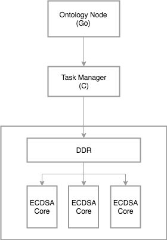

# Design and FPGA Implementation of Fast Signature Verification

Since the signature verification is the most computationally intensive work in
a non-PoW blockchain system, it's performance is directly related to the whole
network's throughput.

This project aims to design a fast signature verification module implemented on
Field-Programmable Gate Array(FPGA) devices, which processes multiple verification
tasks in parallel, and will be used in Ontology Network.

At the first stage, the goals are:

* Implementation of ECDSA verification with curve P-256.
* Task Manager, the host program which schedules tasks and collect results, and
  can be integrated into the Ontology Node.
* The interface between Task Manager and Ontology Node.

# General Design

The Ontology node process collects a batch of signature verification tasks and
sends them to FPGA board throw Task Manager for processing. After all tasks
done, Task Manager collects the results and give back to the node.

Currently, the target platform is AWS F1, a EC2 instance with Xilinx Virtex
UltraScale+ VU9P FPGA carried.

## Kernel

### Input

A verification task needs five parameters serialized into a byte sequence:

| -- hash -- | --- x --- | --- y --- | --- r --- | --- s --- |

Each of the five is 32 byte length.

* hash is the signed hash value
* x and y are the affine coordinates of the public key, in little-endian
* r and s are the 2 integers of signature data, in little-endian

Since, the input data for a task is a 160 bytes sequence.

As for all tasks, the input data are concatenated into a large byte sequence
and passed to the board, stored in DDR from address 0x10. There is another 4
bytes argument which indicates the number of tasks, and stored at 0x00.

### Ouput

The verification result is a bool value. To get all the results, pass an output
array to the kernel.

### ECDSA Core

See [this](./doc/ecdsa.md) for details about ECDSA verification.

# Contributing

Contributions are welcome!

Feel free to open issues for discussion, and create pull requests to post your updates.

# License

This project is under LGPL v3.0 license.
